# Overview

Carbon Emission Calculator is an environmentally friendly application that allows users to calculate the carbon footprint of five aspects of clothing, food, housing, transportation and usage, and understand the carbon emissions generated by current personal lifestyle habits.

# Vision
The vision of Carbon Emission Calculator is to contribute to the global effort to mitigate climate change by inspiring individual and community environmental actions. We believe that, by providing a simple and practical tool, everyone can contribute to a sustainable future for the planet.

# Functions Introduction  

- Carbon Footprint Calculator  
  Users can calculate their personal daily carbon footprint of five aspects of clothing, food, housing, transportation and usage. The principle of carbon footprint calculation is Activity metric X Carbon conversion factor.  
  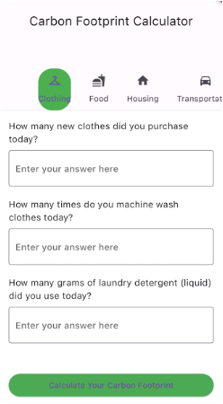
  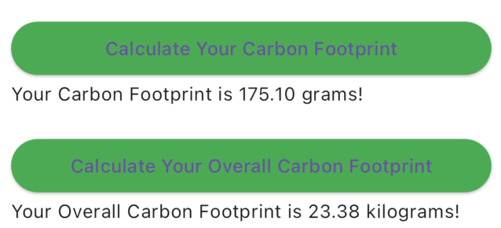  
  
- Carbon Intensity Line Chart  
  Carbon intensity is a measure of how clean our electricity is. It refers to how many grams of carbon dioxide (CO2) are released to produce a kilowatt hour (kWh) of electricity. This line chart is prediction of carbon intensity in the next 48 hours which is drew by using carbon intensity API imported forecast values. Red area means high intensity, yellow area means moderate intensity, green area means low intensity. Users can plug in applicances in green and yellow time period and plug off high-power appliances in red area.  
  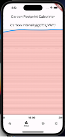
  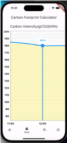
  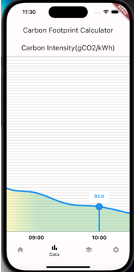  
  
- Knowledge  
  Some hyperlinks about the net zero target related topics for general public to learn basic knowledge in this field.  
  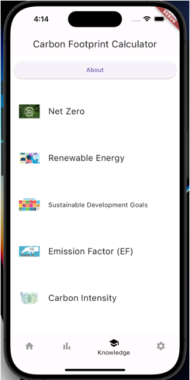
  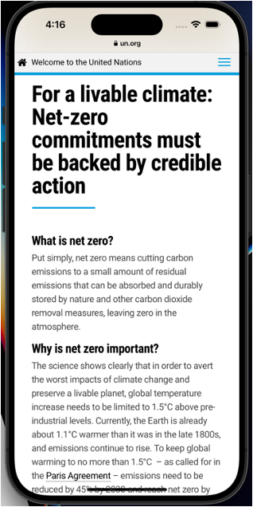
  
- Settings
  Users can edit their personal information, choose color theme, clear cache and view about us page here.  
  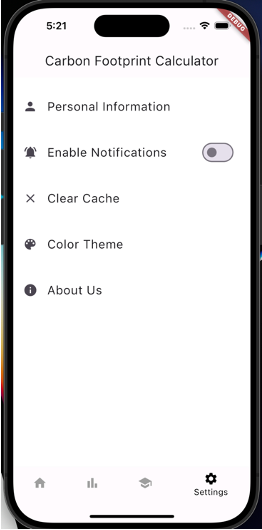
  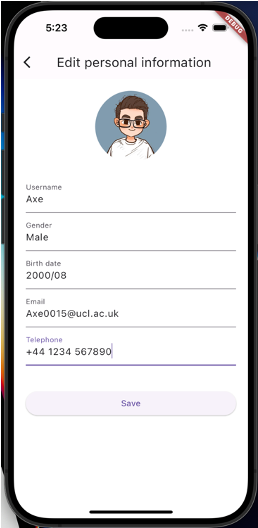
  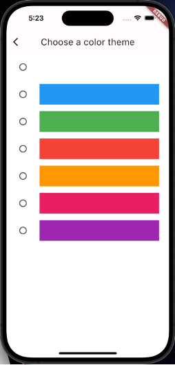
  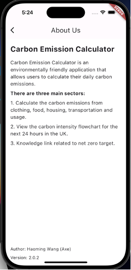  

# Requirements

Any Operating System (ie. MacOS X, Linux, Windows)  
Any IDE with Flutter SDK installed (ie. Android Studio, VSCode, IntelliJ, etc)  
A little knowledge of Dart and Flutter  

# Contact Details

Author: Haoming Wang
Email: whmfmvp@163.com
